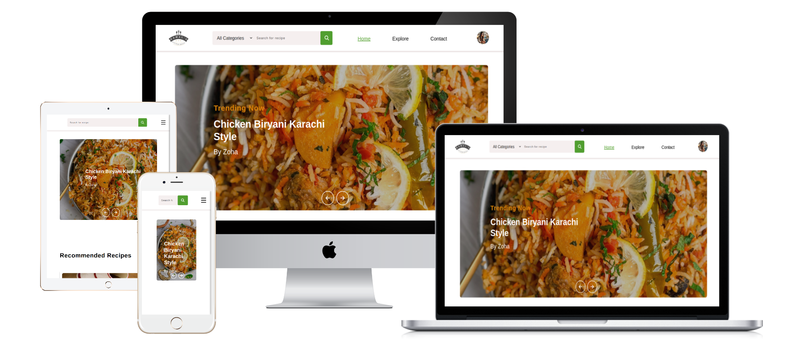

  

# Recipe Website

The Recipe Website offers a seamless way for users to organize and manage their culinary creations. With features that allow you to save and track ingredients, create delicious recipes, and generate detailed shopping lists, it ensures you're always prepared for your next cooking adventure. The app intelligently accounts for the ingredients you have and those you need, simplifying your grocery shopping. Plus, with the option to make recipes public, sharing your culinary magic with others has never been easier. Whether you're a home cook or a culinary enthusiast, this app helps bring your kitchen to life!

## Table of contents

  - [Features](#features)
  - [Getting Started](#getting-started)
  - [Usage](#usage)
  - [Setup](#setup)
  - [Links](#links)
  - [Built with](#built-with)
  - [Continued development](#continued-development)
  - [Live Demo](#-live-demo)
  - [Author](#author)
  - [Contributing](#-contributing)
  - [Show your support](#show-your-support)
  - [Acknowledgments](#acknowledgments)
  - [ Why is Kamal’s Kitchen Magic Special](#why-is-kamals-kitchen-magic-special)
  - [License](#-license)

## 🌟 Features

- Recipe Management: Easily create, save, and organize your favorite recipes with detailed instructions and images.

- Ingredient Tracking: Add and track ingredients, including quantities and availability, to stay organized and avoid food waste.

- Shopping List Generation: Automatically generate a shopping list based on the ingredients needed for a selected recipe.

- Public Recipe Sharing: Share your recipes with the community by making them public for others to discover and try.

- Search and Filter: Quickly search for recipes by ingredients, cuisine, or difficulty level.

- User Profiles: Personalize your experience by creating a user profile to manage your saved recipes and shopping lists.

- Responsive Design: Fully responsive layout ensuring smooth navigation on all devices (desktop, tablet, mobile).

- Easy-to-Follow Instructions: Simple, step-by-step cooking instructions designed for both beginners and experienced chefs.

### Getting Started

To get a local copy up and running follow these simple steps.

Prerequisites
VIsual Studio Code.
A Web Browser (preferably Brave)

### Setup

Clone the GitHub Repository

- git clone "https://github.com/RomeesaKamal/Recipe-website.git"

### Usage

Start your server by clicking Go Live

### Links

- Solution URL: [solution URL here](https://github.com/RomeesaKamal/Recipe-website)
- Live Site URL: [live site URL here](https://romeesakamal.github.io/Recipe-website/)

## Built With

**HTML/CSS & JS best practices:** Correct use of tags, elements, properties and syntax and fetching od API.

**GitHub flow:** Correct use of Branches for deployment and features development.

## 🌎 Live Demo:

- [Live Demo Link](romeesakamal.github.io/Recipe-website/)

## Author

### 👤 **Romeesa Kamal**

- GitHub: [@kamalromeesa](https://github.com/RomeesaKamal/)
- Fronted Mentor: [@Romeesakamal](https://www.frontendmentor.io/profile/RomeesaKamal)
- Linkedin: [@Romeesakamal](https://www.linkedin.com/in/romeesa-kamal-7864b8342/)

## 🤝 Contributing

Contributions, issues, and feature requests are welcome!

Feel free to check the issues page.

## Show your support

Give a ⭐️ if you like this project!

## Acknowledgments

- Thanks to the [Mujeeb ur Rehman](https://github.com/Mujeeb4582/) for the great curriculum.
- Thanks to the Code Reviewer(s) for the insightful feedback.

## Why is Kamal’s Kitchen Magic Special:

- Personalized Cooking Experience: Unlike other recipe sites, Kamal’s Kitchen Magic allows you to manage not only your recipes but also the ingredients in your kitchen. You can track what's available, what needs replenishing, and create your shopping lists based on your unique culinary needs.

- Recipe Sharing Made Easy: Whether you're an aspiring chef or a seasoned cook, our platform enables you to share your magical creations with the world. With the ability to make your recipes public, you'll inspire others while getting inspired by a community of food lovers.

- All-in-One Culinary Hub: From ingredient tracking and meal planning to step-by-step recipes, the app is designed to be your go-to kitchen companion. It’s not just a website—it’s a full kitchen assistant that makes cooking and organizing meals simpler and more enjoyable.

- Intuitive Design & Accessibility: The sleek, user-friendly interface ensures that anyone, regardless of their cooking experience, can easily navigate the website. Plus, the responsive design allows you to access recipes and manage ingredients from any device—whether you're at home or on the go.

## 📝 License

This project is MIT licensed.

_NOTE: we recommend using the [MIT license](https://choosealicense.com/licenses/mit/) - you can set it up quickly by [using templates available on GitHub](https://docs.github.com/en/communities/setting-up-your-project-for-healthy-contributions/adding-a-license-to-a-repository). You can also use [any other license](https://choosealicense.com/licenses/) if you wish._